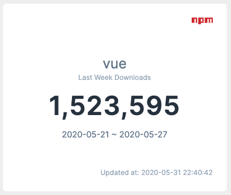
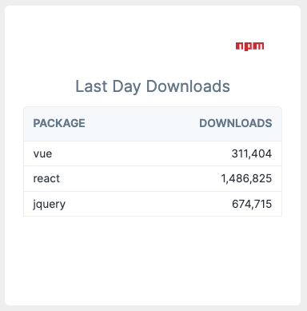

# laravel-dashboard-npm
> Show npm packages stats


## Installation
You can install the package via composer:
```
composer require skydiver/laravel-dashboard-npm
```


## npm package tile
```
<x-dashboard>
    <livewire:npm-package-tile
        position="e1"
        package="vue"
        type="last-week"
        cache-timeout="60"
        :force-refresh="false"
        :show-logo="true"
    />
</x-dashboard>
```


## npm packages table tile
```
<x-dashboard>
    <livewire:npm-packages-table-tile
        position="e1"
        packages="vue,react,jquery"
        type="last-week"
        cache-timeout="60"
        :force-refresh="false"
        :show-logo="false"
    />
</x-dashboard>
```

## Shared options
| Option        | Description                                           | Valid Options                   | Default    |
|---------------|-------------------------------------------------------|---------------------------------|------------|
| type          | type of download                                      | last-day, last-week, last-month | last-month |
| cache-timeout | seconds to refresh package info                       | -                               | 600        |
| force-refresh | force refrsh package info (useful during development) | true, false                     | false      |
| show-logo     | show npm logo at top right conrner                    | true, false                     | true       |


## Demo
* npm-package-tile



* npm-packages-table-tile


